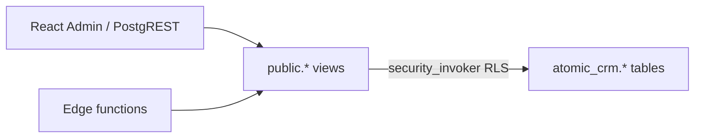

# Move tables to `atomic_crm` with public views

## Decisions (locked)

- Schema name: **`atomic_crm`** (underscore)
- **No tables in `public`** — all 10 current tables live in `atomic_crm`
- **`public` exposes views only**: simple pass-through views for every former table name (so RA writes + edge `.from("…")` keep working), plus the existing derived views
- **Drop unused `private` from Atomic CRM** — remove the stale comment and `create schema if not exists "private";` from [`01_tables.sql`](supabase/schemas/01_tables.sql). Migration should `DROP SCHEMA IF EXISTS private` only if it is empty / owned by this app’s leftover create (Atomic CRM never put objects there). Parent Ask Aneka `apps/supabase` still creates/owns its own `private` when composed — that stack is out of scope here
- **Functions stay in `public`**, rewritten to reference `atomic_crm.*` with explicit qualification (`search_path = ''` where already used)
- **Do not** add `atomic_crm` to PostgREST `[api].schemas` in [`supabase/config.toml`](supabase/config.toml) / [`supabase/config.e2e.toml`](supabase/config.e2e.toml) — API surface stays `public` views only
- Frontend / FakeRest: **no resource renames** if public view names match today

## Target `public` surface

**Pass-through (auto-updatable) views** — `SELECT * FROM atomic_crm.<table>` with `security_invoker = on`:

`companies`, `contacts`, `contact_notes`, `deals`, `deal_notes`, `sales`, `tags`, `tasks`, `configuration`, `favicons_excluded_domains`

**Derived views** (already exist; retarget sources to `atomic_crm`):

- `companies_summary`, `contacts_summary`, `activity_log` — `security_invoker = on`
- `init_state`, `configuration_branding` — keep `security_invoker = off` (anon-safe)

RA remapping in [`dataProvider.ts`](src/components/atomic-crm/providers/supabase/dataProvider.ts) stays: reads for companies/contacts → `*_summary`; writes → base names (now pass-through views).

## Declarative schema edits (`supabase/schemas/`)

1. **[`01_tables.sql`](supabase/schemas/01_tables.sql)**  
   - `create schema if not exists atomic_crm;`  
   - Remove the unused `private` schema create + comment  
   - Redefine all tables as `atomic_crm.<name>` (FKs, indexes, sequences move with them)

2. **[`03_views.sql`](supabase/schemas/03_views.sql)**  
   - Add the 10 pass-through views  
   - Point existing views at `atomic_crm.*` instead of `public.*`

3. **[`02_functions.sql`](supabase/schemas/02_functions.sql)**  
   - Retarget every `public.<table>` / unqualified table ref to `atomic_crm.*`  
   - Hotspots: `handle_new_user` / `handle_update_user`, `is_admin`, `merge_contacts`, `set_sales_id_default`, `handle_contact_note_created_or_updated`, favicon helpers using `favicons_excluded_domains`

4. **[`04_triggers.sql`](supabase/schemas/04_triggers.sql)**  
   - Attach triggers to `atomic_crm.*` tables; auth.users triggers unchanged (bodies updated above)

5. **[`05_policies.sql`](supabase/schemas/05_policies.sql)**  
   - Enable RLS + recreate policies on `atomic_crm.*` (same policy semantics as today)

6. **[`06_grants.sql`](supabase/schemas/06_grants.sql)**  
   - `GRANT USAGE ON SCHEMA atomic_crm` to `authenticated`, `service_role` (and whatever is required for invoker views; **not** exposing the schema via PostgREST)  
   - Table privileges on `atomic_crm.*` for `authenticated` / `service_role` as needed for `security_invoker` views  
   - View grants on `public.*` views (mirror current table grants; branding view stays select-only)  
   - Revoke any leftover expectation of base tables in `public`

## Migration approach

- Prefer editing declarative schemas, then generate with `npx supabase db diff --local -f move_tables_to_atomic_crm`
- Manually review the diff: for existing DBs, prefer **`ALTER TABLE … SET SCHEMA atomic_crm`** (and recreate views) over drop/recreate so data is preserved
- Apply locally with `npx supabase migration up --local` (or reset if you’re treating this as greenfield)
- Migration on disk: [`supabase/migrations/20261109060000_atomic_crm_custom_schema.sql`](supabase/migrations/20261109060000_atomic_crm_custom_schema.sql)

## Seeds (after schema move)

- [`supabase/seed.sql`](supabase/seed.sql) must target `atomic_crm.<table>` (or the matching public pass-through view) — not unqualified / `public.` base tables that no longer exist
- Today the only CRM seed data is `favicons_excluded_domains`; qualify inserts to `atomic_crm.favicons_excluded_domains`
- Do not change unrelated Ask Aneka monorepo seeds under `apps/supabase` unless they are clearly on this app’s seed path

## Code that should keep working without renames

| Layer | Why |
|-------|-----|
| RA resources / dataProvider | Same public names |
| Edge (`users`, `postmark`, `getUserSale`) | `.from("sales")` etc. hit public views |
| MCP `table_schema = 'public'` | Still lists views |
| FakeRest | Unchanged in-memory model |

Only update edge/SQL if something bypasses PostgREST and talks to base tables with a hard `public.` qualifier (functions migration covers SQL; spot-check edge for raw SQL).

## Verification

- `make typecheck` / smoke: login, list/create/update company + contact, deal kanban write, merge contacts RPC
- Anon: `init_state` + `configuration_branding` still readable
- Confirm PostgREST OpenAPI / REST has **no** direct `atomic_crm` paths
- Confirm `\dt public.*` (or equivalent) shows **zero** tables after migrate/reset
- Confirm `npx supabase db reset --local` (or seed) applies `seed.sql` cleanly against `atomic_crm.*`
